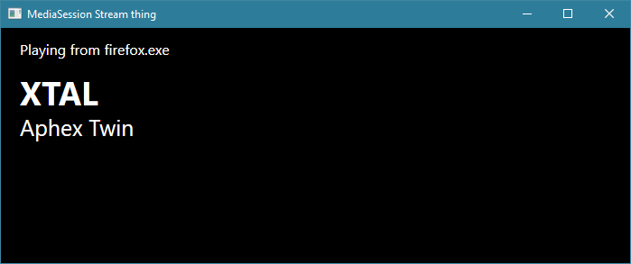

# MediaSession Stream thing

This is a widget that displays the currently playing Media Item, and is intended for livestreaming. It uses [DubyaDude's WindowsMediaController package](https://github.com/DubyaDude/WindowsMediaController) to read from the Windows 10/11 API.

It will automatically read the latest media item played by any supported program, including Spotify and Windows Media Player, as well as most websites when using Edge, Firefox or Chrome.

This widget is only available as an executable. You can capture the window and overlay it using your streaming software of choice. The program does not need an internet connection.

## [Download the latest release](https://github.com/x-sheep/WindowsMediaController/releases)
